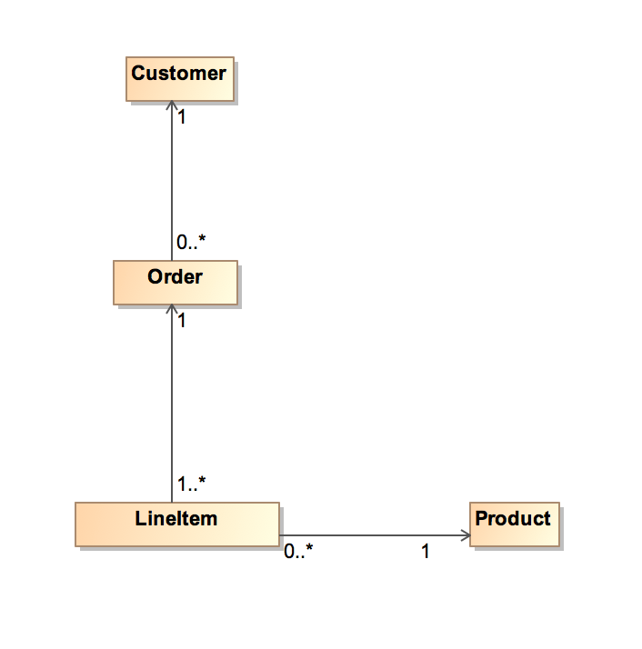
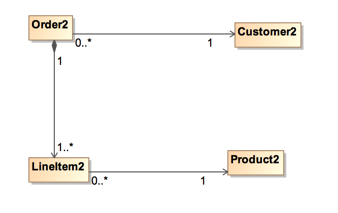
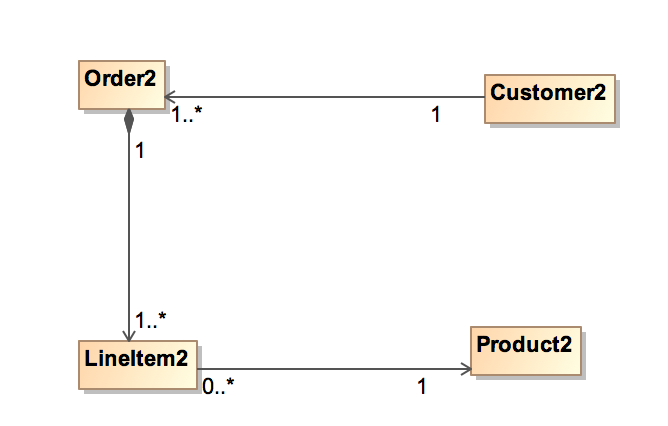

## Naming resources (URI)
In addition to using HTTP verbs properly, it is essential to create URI that make the use of simple and intuitive API.

A REST API consists of: 
- A collection of URIs
- HTTP calls to these URIs (verbs) 
- XML representations / JSON resources

Each resource on the server server is accessible through the URI. As opposed to a verb that describes an action, a resource is a common name that describes an entity. The URI naming must follow a coherent hierarchical structure to ensure its usability.


### Best Practices
To illustrate the best practices, we rely on customers entities, orders, order lines and products.

The naming of resources may be the following:

| Ressource | Nommage de la ressource |
| -- | -- |
| Client | customers |
| Order | orders |
| Order Line | lineitems |
| Product | products |

Resources are named in the plural and in lower case.

This is due to the fact that the service will send a collection of objects when no identifier is present in the URI. 
Below are some examples:


| Operation | URI|
| -- | -- |
| Create a new customer | POST http://api.europcar.com/customers |
| Get/Update/Delete customer 12345 | GET/PUT/DELETE http://api.europcar.com/customers/12345 |
| Create a new order for customer 12345 | POST http://api.europcar.com/customers/12345/orders |
| Get orders of customer 12345 | GET http://api.europcar.com/customers/12345/orders |
| Create an order line in the order 67890 pour the customer 12345 | POST http://api.europcar.com/customers/12345/orders/67890/lineitems |
| Get the first forder line in the order 67890 for the customer 12345 | GET http://api.europcar.com/customers/12345/orders/67890/lineitems/1 |

The examples below illustrate the concept of hierarchy to be applied and the traversability of the hierarchy via a unique ID that is interposed between the common names representatives the traversed entities.

 ### Practices to be avoided
 The first anti-pattern is to group REST services within a single URI and using the parameters of the query-string to distinguish services from one another. For example, the update  URI of a customer could be:

```
GET http://bad-api.europcar.com/services?op=update_customer&id=12345&format=json
````

The problem is that this URL is not self-described. 
1. neutral GET verb designates a transaction which is not. 
2. The URI has a hierarchical structure identical for all theresources. This does not allow to differentiate the resources accessed just through the reading of the URI. 
3. The format of the returned message should be indicated in the header (Header `` `Accept: application / json```). This information is independent from the context of the application, this information must be in the header.


Another wrong use is to mention the operation in the URI:
```
GET http://bad-api.europcar.com/customers/12345/create
```

The URL must designate a resource and not an operation on a resource. The URI must be identical regardless of the operation that is performed on the resource (POST / GET / PUT / DELETE)

### Pluriel versus singulier


The rule to follow is this. When the resource refers to a collection of objects then we must use the plural.

But what happens when no resource actually exists on the server ? Consider that we wanted to build a service that verifies that the email referred respects a well-defined pattern. 

This is a neutral operation, the appropriate HTTP verb GET verb. 

In our case, there is no pattern entity in the database, we would be tempted to use the singular with type URI:
```
GET http://bad-api.europcar.com/pattern-valid
```

This violates the principle of hierarchy. One solution is to consider that there are a multitude of patterns, we can deduce that the pattern is a virtual entity to be designated by a name in the plural. To validate the email, we can consider that the identifier "email" is our pattern in this virtual collection patterns.


The URI could then be written::
```
GET http://api.europcar.com/patterns/email
```

The validity may be regarded as a property and thus will appear later in the hierarchy. The final URI becomes:

```
GET http://api.europcar.com/patterns/email/validity
```

The value entered by the customer will be sent in the query string. This gives us the following call:
```
GET http://api.europcar.com/patterns/email/validity?value=name@domain.com
```
# Exposing objects
Objects can be exposed to the client as a hierarchy of composition or an association of objects. It is this composition or association which must result in the URI to the resource. 

Composition / aggregation: the hierarchy materializes the relationship between a resource and sub-resources within it. These have the life cycle of the main resource and are only accessible via the latter. 

Association: this relationship materializes between autonomous  resources (which may exist outside this relationship). 

Consider the following relational schema:





- A order is the combination of one or more order lines to one and only client. 
- A client may never have placed an order. 
- A product may never have been ordered. 

The following combination of structures are possible:


|URI | Design choice |
| -- | -- |
|URI1 ||
|URI2 ||

The choice of one or other of the models is entirely at the discretion of the business analyst and the hierarchical view he wishes to give to the information system. The following URIs are equivalent:

| HTTP Verb | URI1 | / URI2 |
| -- | -- | -- |
| Description | The business analyst only requires knowledge of the order to access the order line of the said order.| In the second case, access to the order lines also requires to know the customer id. |
| GET | /orders/12345/lineitems |/customers/6785/orders/12345/lineitems |

In either case, nothing prevents the business analyst to provide access to orders, customers or command line directly via a unique access key. Again this is a business choice about resource exposure via the REST API.

When accessing an object, we may want to discriminate it by an attribute. When this attribute identifies the accessed resource in a unique way in the hierarchy, then it will be part of the URI.
Access to a sub-resource without an id may be done using an index or position

In any other case, this will be a search criteria

In the example below, we want orders passed on 09.10.2015.

``` .../orders/20150910 ``` should be avoided because several commands may have been passed on 09.10.2015. Acorrect query is: ``` .../orders?date=20150910``` and the result is a collection.

Composition vs Association: We model a composition when the REST call return in the stream the sub-resource, and an association when the REST call returns only a technical and / or functional id with a label (see external fragments / XF)

## exécution d'opérations métier
In business cases (other than CRUD), invoking a REST service typically returns the result of execution of an business act. These include the following business activities: 
- Sign the contract 
- Validate rent 
- Notify the customer


In these cases, it is replaced by the proper noun word as shown in the table below:

| Action | URI Example | Description|
| -- | -- | -- | -- |
| Sign the order | POST /orders/12345/signature | Create the signature and associate it with the order |
| Valider la commande | PUT /orders/12345/validation | Mettre à valide  du statut de la commande |
| Notifier le client | POST /customers/789067/notification | Création d'une notification et association au client |

Dans le tableau ci-dessus, la description indique la perception qu'a le client du service REST. Dans la réalité, les opérations qui ont lieu sur le S.I. sont beaucoup plus riches et complexes.

Note : suivant les cas métier, l'invocation du service sera accompagnée ou non d'un payload

L'usage de ces substantifs permet de conserver l'intention métier et le bon niveau d'abstraction des opérations

Le choix du verbe (PUT, GET , POST, DELETE) dépendra de l'idempotence et de la neutralité de l'action que l'on souhaite exécuter. 
