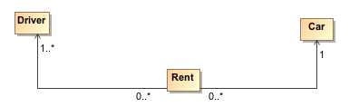
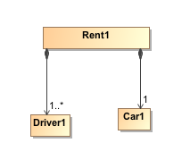
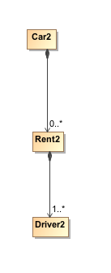

### Représentation des données en entrée / sortie
#### Les règles de nommage
Les objets sont exposés au client comme une hiérarchie de composition d'objets. C'est cette composition qui doit permettre d'obtenir l'URI d'accès à la ressource.

Considérons le schéma relationnel suivant :



- Une location est le rapprochement d'un ou plusieurs drivers à un et un seul véhicule.
- Un Driver peut n'avoir jamais loué de véhicule
- Un véhicule peut ne jamais avoir été loué.

Les structures de composition suivantes sont alors possibles :

|Type URI | Choix de conception |
| -- | -- |
|URI1 ||
|URI2 ||

Le choix de l'une ou de l'autre des modélisations est entièrement à l'appréciation de l'analyste métier et de la vue hiérarcchique qu'il souhaite donner au système d'informations. Les URIs suivantes sont équivalentes :

|Verbe HTTP | URI1 | / URI2 |
| -- | -- | -- |
| Description |l'analyste métier impose uniquement la connaissance du contrat de location pour accéder au drivers de la dite location.| Dans le second cas, l'accès au drivers impose de connaître également le véhicule utilisé pour la location. |
| GET | /rents/12345/drivers |/cars/6785/rents/1/drivers |

Dans les deux cas, rien n'empêche l'analyste métier de permettre l'accès aux drivers, véhicules ou locations directement via une clef d'accès unique. Là encore il s'agit d'un choix métier quant à l'exposition des ressources via l'API REST.

Lors de l'accès à un objet, on peut vouloir le discriminer par un attribut. Lorsque ceta ttribut identifie de manière unique dans la hiérarchie accédée la ressource, alors il fera partie de l'URI. Dans les autres cas, ce sera un critère de recherche. 

Dans l'exemple ci-dessous, on souhaite les véficule de type VW.

``` .../cars/VW ``` est à proscrire car plusieurs véhicules peuvent être de type VW. uen requête correcte est la suivante : ``` .../cars?type=VW``` et le retour sera une collection.


#### Objets

- L'exposition d'une ressource fait fi de sa représentation réelle dans le système d'information (cf. exemple pattern précédent).
- Lorsqu'un objet est renvoyé, il doit être auto-décrit. On retrouvera tous les critères ayant permis 
de renvoyer l'objet dans l'objet renvoyé en retour s'ils font partie de l'objet renvoyé. Ainsi lors d'un accès par ID, l'ID devra être également inclus dans l'objet retourné.

``` /cars/12345 ``` renverra un véhicule 

``` 
{
 "id":"12345", // id est repris bien qu'il soit dans l'URI 
 "type":"VW"
  ...
} ```


- L'objet renvoyé n'est jamais nommé. S'il sgit d'un type structur JSON, il se présentera avec les attributs encadrés par une accolade ouvrante et une accolade fermante.
- 


#### Collections
Lorsqu'une 
#### Les dates
Les dates sont transmises de deux manières différentes selon qu'elles soient précisées dans un entête HTTP ou dans le corps de la requête / réponse.

Dans l'entête HTTP, les dates doivent respecter la RFC 1123 qui consiste à transmettre la date au format suivant :
````
Mon, 3 Aug 2015 09:26:12 GMT
````
Cette date comme on peut le voir ne permet pas d'avoir accès aux millisecondes. La pattern Java à appliquer pour l'obtenir est
```
EEE, dd MMM yyyy HH:mm:ss 'GMT'
```

Dans le corps de la requête ou de la réponse, les dates sont envoyées au format ISO8601 :
```
yyyy-MM-dd'T'HH:mm:ss.SSS'Z'
```

