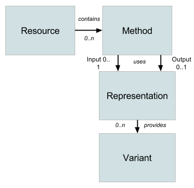

## The six constraints of REST
### Uniform Interface

This constraint is defined by the fact that each resource is uniquely identified through a URI. The server returns a representation of the resource to the client with respect to a predefined schema that is independent of the physical representation of the resource on the server. The most common formats are JSON and XML encoded as UTF-8 entities.

### Stateless
Stateless approach is key to the REST architecture style. It implies that all the data required to service the request is contained within the URI, the URI parameters (query-string), the body of the request and/or the headers. Once the request is serviced, the server returns the exhaustive information required to submit future requests through the headers, the body and the response status code.

This is a breaking change with the classical approach where data is stored in a server side session store and made available to any future requests from the same user in the same session. REST requires that each client includes all the data required by the server to execute the request.

The stateless approach brings more scalability to applications since the server does not need to maintain and/or replicate the session state. Moreover, load balancing components do not have to be aware of the session affinity that are usually complex to implement at the infrastructure level and makes deployment of a new version of the application less smooth since it requires all sessions to be shutdown first.

P.S. Nonetheless, it is not always possible to have a stateless approach . Services like OAuth require information to be maintained in the session store. Compatibility with previous versions of the application may also be a motivation to maintain session data across requests

When maintaining a session is essential, you must :
- Make sure that the data in the session store are not used as a temporary state between HTTP requests but exclusively used as a cache holding data that will stay valid during the whole session.
- Make sure that the session is available across the whole server farm (no session affinity).

### Cache enabled
Proxies as well as Web clients (whether desktop of mobile) are able to store responses in their own cache. Responses should thus, implicitly or explicitly, define themselves as cache candidates or not to avoid useless requests or use of obsolete data. Good use of caching may greatly improve scalability and performance.

### Client / Server
It is the client that initiates the request.
The client and the server exchange data whose representation is independent from both, the server side data representation and the client side user interface. This allows both parties (client and server) to evolve independently from each other as long as the data interchange format is respected and stays compatible.

### Layered System
A client cannot guess if he is directly connected to the target application server or if he is served by a proxy server. Usually theses proxies may be load blancers, shared cache services or authentication and habilitation services.

###Exécution de code à la demande (Optionnel)
Cette contrainte est la seule optionnelle des six contraintes REST imposées. Elle permet de renvoyer au client du code qui sera exécuté sur le poste client pour étendre les fonctionnalités du serveur. Il peut s'agir d'applets Java ou de scripts javascript. Cela peut concerner notamment l'accès à des périphériques locaux.

Note : Europcar n'a pas prévu d'utiliser l'exécution de code à la demande.

## Concepts
- En REST, l'abstraction clef désignant l'unité d'information est la ressource. Tout information qui peut être nommée est potentiellement est une ressource. Plus généralement, tout concept qui peut être désigné par une référence hypertexte doit être considéré comme une ressource.
- Une ressource est accédée au travers d'une URI.
- Une URI peut être invoquée via une ou plusieurs méthodes (GET / PUT / POST / DELETE) en fonction de l'opération que l'on souhaite exécuter (Lecture / Mise à jour / Création / Suppression).
- Une invocation de service REST peut inclure dans le corps de la requête des paramètres en entrée représentant un objet métier et recupérer dans la réponse une représentation de l'objet métier dans le flux de retour.
- Plusieurs variantes d'une représentation sont possibles. En général on retrouve les variantes JSON et XML.

Le diagramme ci-dessous illustre ces concepts.

Figure : http://www.apigee.com

